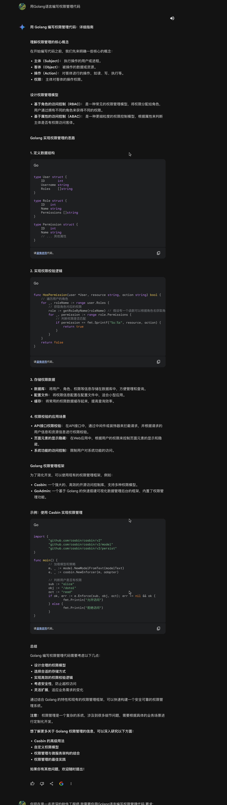
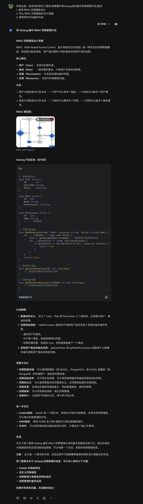

# Q：针对prompt engineering 的特点，描述在使用 gemini 时应该怎么做从而获取更加准确的答案

1. 提供背景信息,背景信息越详细，模型的理解越准确
2. 指定AI的角色,比如你是一个软件工程师
3. 目标明确,明确你想要AI做什么
4. 提供样例,样例越多，模型输出结果越准确
5. 明确输出格式
6. 如果输出结果不符合预期,可以通过多次尝试,调整背景,目标,样例等信息来获取答案

# 提问

下图可见,增加提问的背景,明确想要达成的目标,目标的原则是简单明确,用简单的语言描述,不要使用专业术语,大模型和计算机一样,你告诉它什么,他就给你什么,
不要期望它能理解你的意图,这是一个很大的误区,所以要求模型输入要简单明了,不要过于复杂

# 提问1

# 提问2

