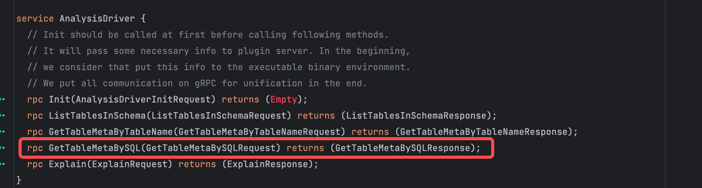
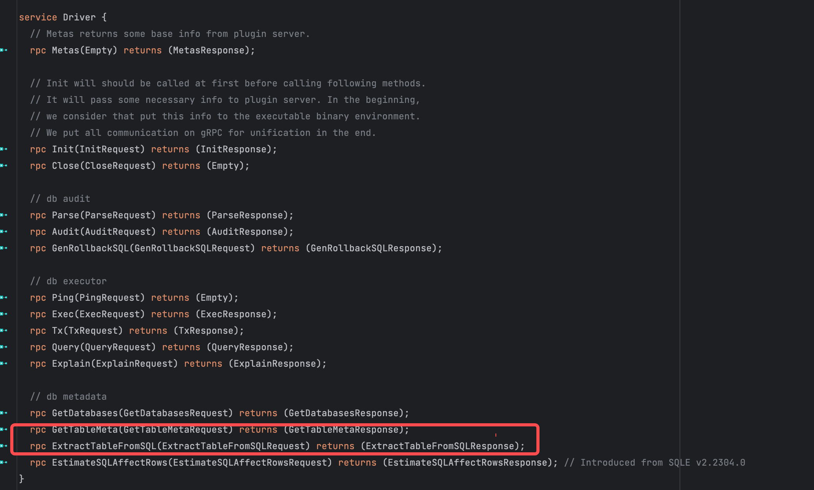
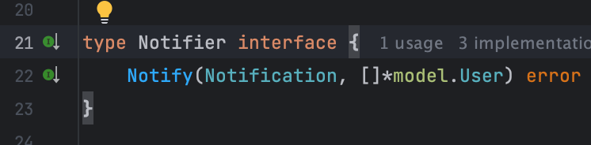
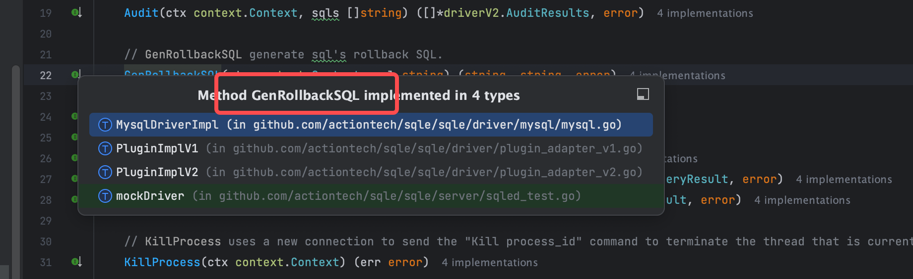
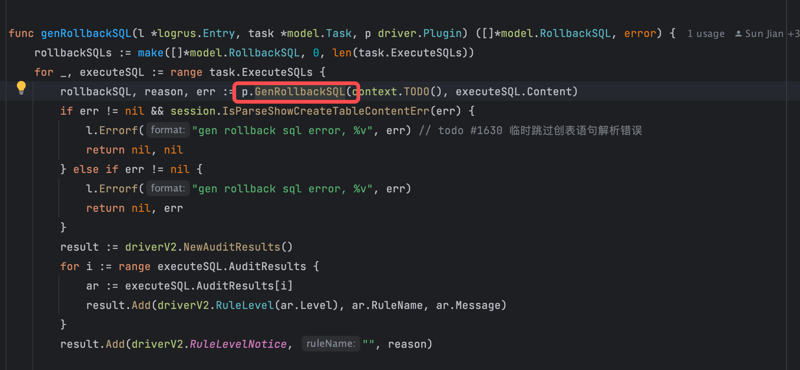
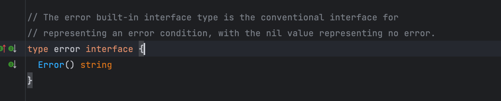
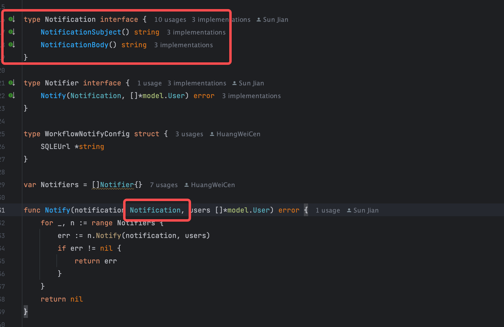

1. 什么是 solid 原则，为什么需要 solid 原则？
   solid原则分为5个原则，分别是单一职责原则、开闭原则、里氏替换原则、接口隔离原则、依赖倒置原则。
    - 单一职责原则: 类或模块功能单一,指责单一,简化代码逻辑,减少耦合,方便外层组合调用
    - 开闭原则: 对扩展开放,对修改关闭
    - 里氏替换原则: 任何实现该接口的类,都可以替换该接口,而不影响程序的正确性
    - 接口隔离原则: 接口应该足够小,足够简单,应该刚刚好符合其用途,不多不少
    - 依赖倒置原则: 高层抽象不应该依赖于低层实现,应该依赖于抽象

   使代码足够简单,提高可读性,减缓变成高复杂性项目的速度,提高项目可维护性

2. 每一个原则使用 go 代码举出具体的例子

- 单一职责原则
  图1 的接口功能包含图2 红圈内的两个方法的功能,违反了单一职责原则
  
  
- 开闭原则
  通知接口对扩展开放,对修改关闭
  
  
- 里氏替换原则
  任何实现 GenRollbackSQL 方法的类,都可以生成回滚sql,而不影响程序的正确性
  
  
- 接口隔离原则
  go 标准库 error 接口,只有一个方法 Error,足够简单,刚刚好符合其用途
  
- 依赖倒置原则
  根据不同 Notification 的实现,决定不同的通知正文
  