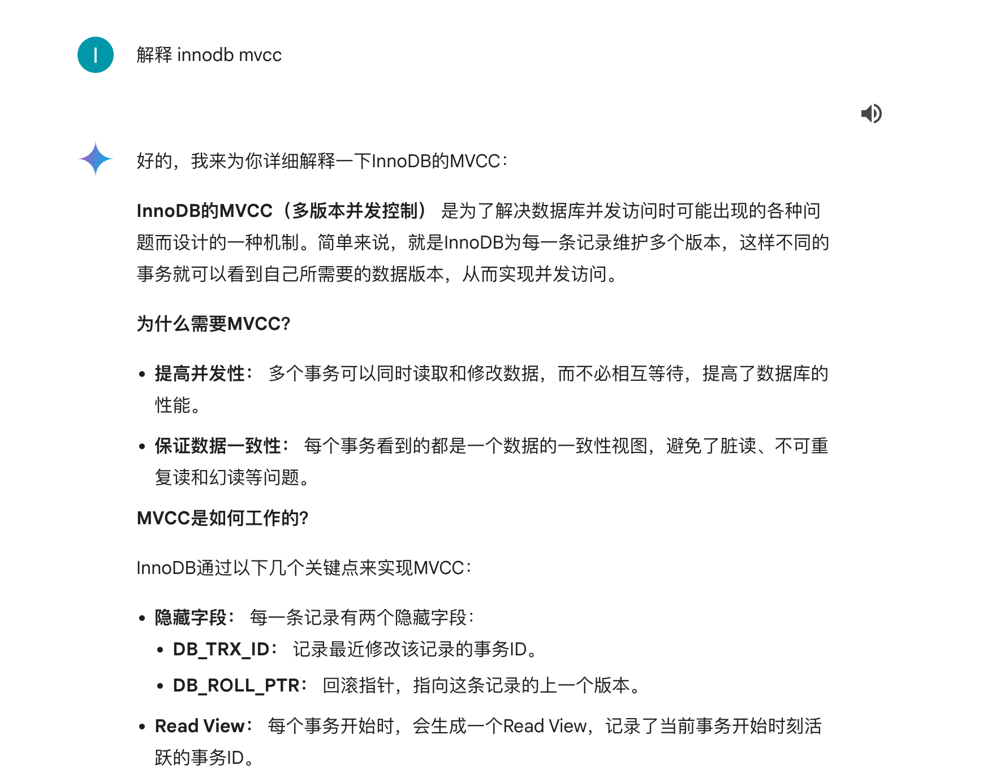
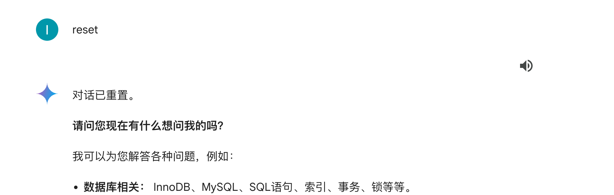
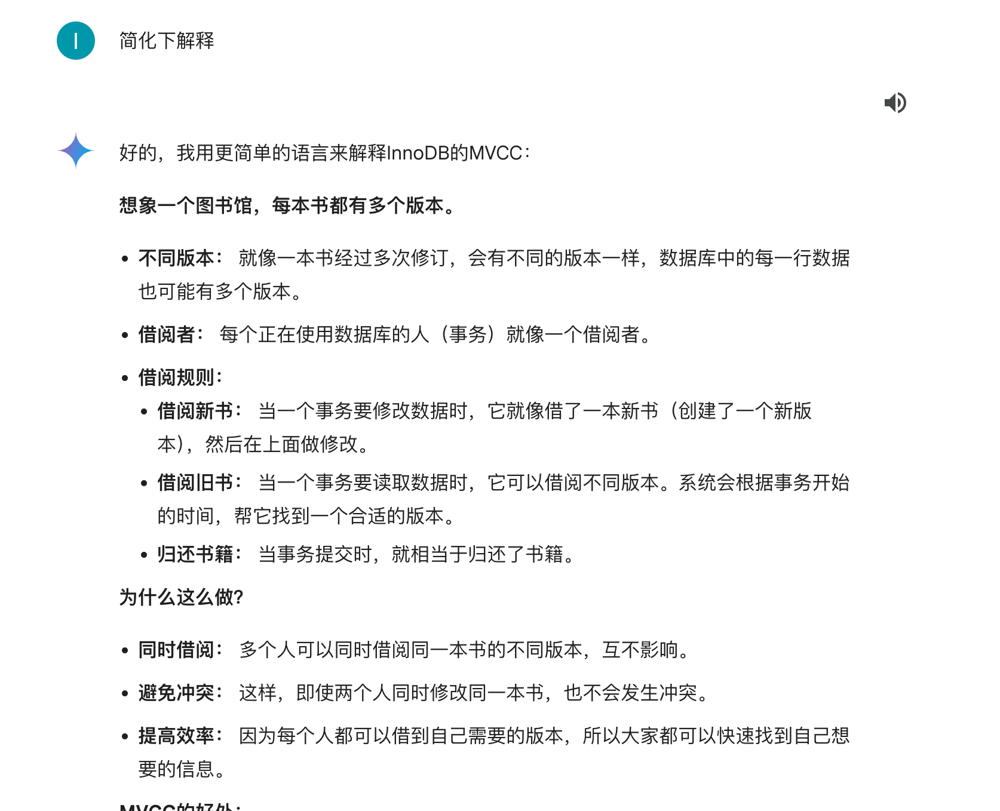

1. 为什么gemini不需要用户输入训练数据就能快速给到答案?

Gemini 在训练过程中已经学习到了大量的知识，所以在用户输入问题后，Gemini可以直接给出答案。

2. 列一张清单，描述适合使用以及不适合使用gemini的场景

适合使用Gemini的场景：

- 问答系统
- 代码生成
- 语言翻译
- 语音识别
- 图像识别

不适合使用Gemini的场景：

- 设计个人隐私的应用
- 需要高度准确性的应用
- 需要大量人工干预的应用

3. 连续问gemini 一连串的问题,接着输入reset, 思考发生了什么，写出你的实验发现

执行reset指令,gemini未忘记主题

