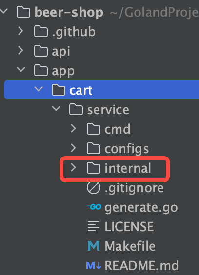

### 参考资料：https://github.com/golang-standards/project-layout/blob/master/README_zh.md

1. pkg 存放项目可导出的包，internal 存放项目不可导出的包

2. 利用 gofmt ， goimports ， golint 保证代码风格
3. 包名只能是小写字母
4. 重命名标准库，最好在最前面加上 go ，例：import gourl "net/url"
5. 使用
```shell
if err != nil {
	// error handling
	return // or continue, etc.
}
// normal code
```
代替
```shell
if err != nil {
	// error handling
} else {
	// normal code
}
```